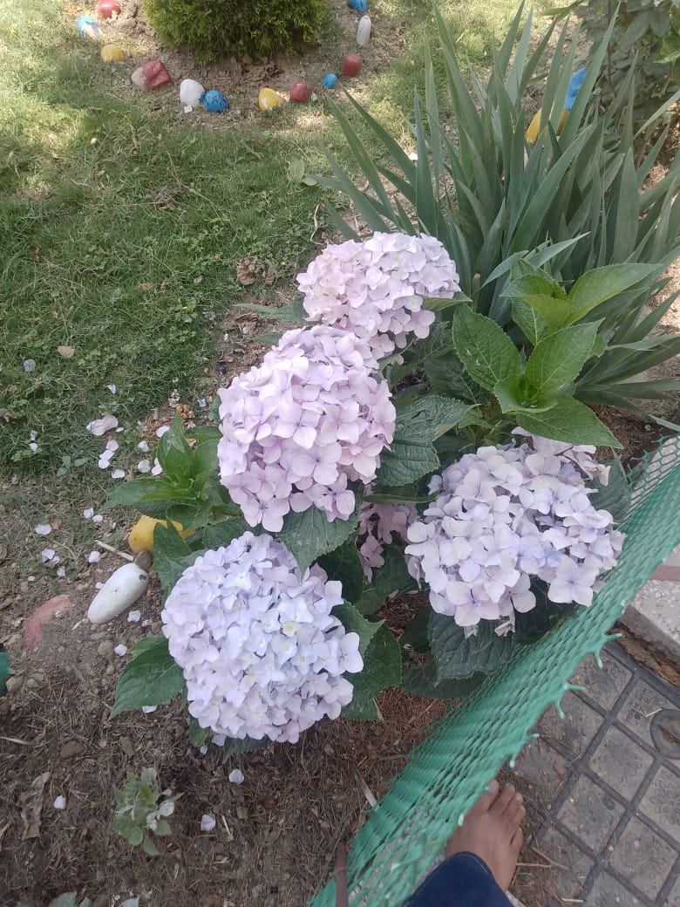

# Image Playground

A simple project for experimenting with image processing and manipulation.

## Features

- Load and display images
- Apply basic filters and transformations
- Save edited images

## Getting Started

1. Clone the repository:
    ```
    git clone https://github.com/yourusername/Image_playground.git
    ```
2. Install dependencies:
    ```
    pip install -r requirements.txt
    ```
3. Run the application:
    ```
    python main.py
    ```
4. You can use image given in this repository
   

   
## Folder Structure

- `main.py` - Entry point of the application
- `requirements.txt` - Necessary libraries
- `README.md` - Project documentation
- `images/` - Sample images for testing
  


## License

MIT License